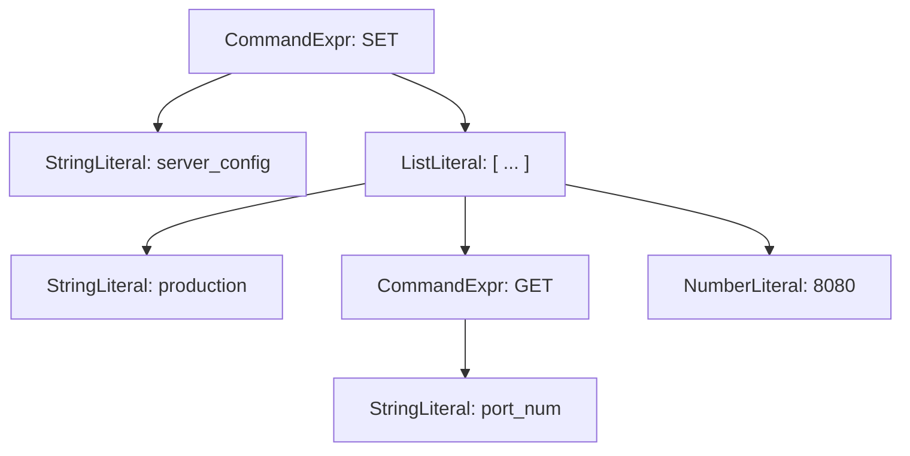
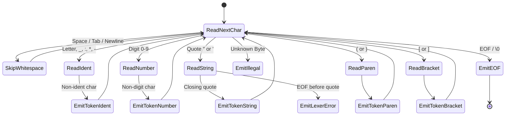
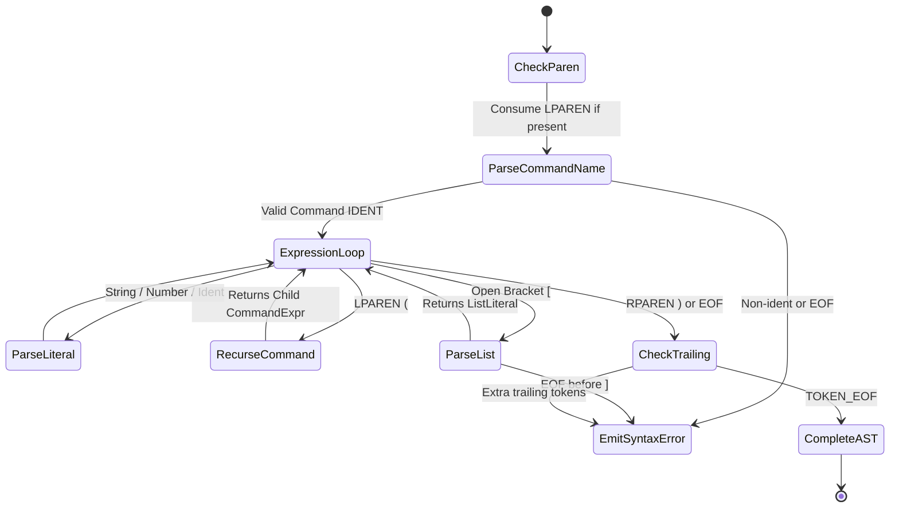

# Raven Query Language (RQL) - Specification & Syntax Guide

```text
                  /\
                 /  \
                / /  \
               | (o)  |======>
                \    /
               /      \
              /  /\    \
             /  /  \    \
            /  /    \    \
           /  /      \    \
          |  |        |    |
          |__|        |____|
       ========================
            R A V E N  Q L
  Raven Query Language Specification
```

**Raven Query Language (RQL)** is the formal query language of Raven DB. It combines **Redis command semantics** with a **Lisp/S-expression AST evaluation model**, supporting quoted literals, nested sub-queries, and array list expressions.

---

## 📖 1. Formal Grammar & Syntax Rules

### Rule 1: Command Expression Structure
Queries follow an imperative command-first pattern consisting of a **Command Name** followed by zero or more space-separated arguments:
```text
COMMAND_NAME [arg1] [arg2] ... [argN]
```

### Rule 2: Case Insensitivity
Command names are case-insensitive. `set`, `Set`, and `SET` evaluate identically:
```text
set key1 "value"
SET key1 "value"
```

### Rule 3: Literal Types
1. **Identifiers / Unquoted Strings**: Continuous alphanumeric sequences (supports `_`, `:`, `*`, `-`).
2. **Quoted Strings**: Enclosed in single `'...'` or double `"..."` quotes. Supports spaces and escape sequences (`\"`, `\\`).
3. **Number Literals**: Continuous digits and decimal points (e.g. `100`, `3.14`).

### Rule 4: Sub-Command Expressions `(...)`
Sub-queries enclosed in parentheses `( ... )` evaluate **inside-out** recursively before the outer command executes:
```text
SET user_role (GET default_role)
```

### Rule 5: List Literals `[...]`
Values enclosed in square brackets `[ ... ]` construct structured lists containing strings, numbers, or sub-queries:
```text
SET server_config [ "production" (GET port_num) 8080 ]
```

---

## 🌲 2. Abstract Syntax Tree (AST) & Token Specification

### Token Structure ([`lexer.go`](file:///home/ahmed/golang/redis-clone/internals/parser/lexer.go))
Every lexical token is emitted with exact source coordinates:
```go
type Token struct {
    Type     TokenType // e.g. TOKEN_IDENT, TOKEN_STRING, TOKEN_LPAREN, etc.
    Literal  string    // Raw literal string representation
    Line     int       // 1-based source line number
    Column   int       // 1-based source column number
    Position int       // 0-based character offset
}
```

### AST Node Hierarchy ([`ast.go`](file:///home/ahmed/golang/redis-clone/internals/parser/ast.go))
RQL queries are parsed into a tree of typed nodes implementing the `Node` interface:

| AST Node Type | Code Struct | Description | Example |
| :--- | :--- | :--- | :--- |
| **`CommandExpr`** | [`*parser.CommandExpr`](file:///home/ahmed/golang/redis-clone/internals/parser/ast.go#L40-L43) | Command invocation node | `SET key val` |
| **`StringLiteral`** | [`*parser.StringLiteral`](file:///home/ahmed/golang/redis-clone/internals/parser/ast.go#L12-L14) | Text or identifier literal | `"Hello World"` |
| **`NumberLiteral`** | [`*parser.NumberLiteral`](file:///home/ahmed/golang/redis-clone/internals/parser/ast.go#L20-L22) | Numeric literal | `42` |
| **`ListLiteral`** | [`*parser.ListLiteral`](file:///home/ahmed/golang/redis-clone/internals/parser/ast.go#L28-L30) | Array list literal | `[item1 item2]` |

### Visual AST Representation

For the RQL query: `SET server_config [ "production" (GET port_num) 8080 ]`



---

## ⚙️ 3. Finite State Machines (FSM)

### Lexer FSM ([`lexer.go`](file:///home/ahmed/golang/redis-clone/internals/parser/lexer.go))
Scans character streams (`ch byte`) into tokens (`[]Token`) while tracking exact `(line, col)`:



---

### Parser FSM ([`parser.go`](file:///home/ahmed/golang/redis-clone/internals/parser/parser.go))
Consumes tokens to construct AST trees with error boundary checks:



---

## 📋 4. Supported Commands Quick Reference

| Command | Syntax | Description |
| :--- | :--- | :--- |
| `PING` | `PING [message]` | Returns `PONG` or input message |
| `ECHO` | `ECHO <message>` | Echoes input back to client |
| `SET` | `SET <key> <value> [ttl_seconds]` | Sets key value with optional TTL |
| `GET` | `GET <key>` | Gets value for key |
| `DEL` | `DEL <key1> [key2 ...]` | Deletes one or more keys |
| `EXISTS` | `EXISTS <key1> [key2 ...]` | Checks existence of keys |
| `KEYS` | `KEYS` | Lists active database keys |
| `EXPIRE` | `EXPIRE <key> <seconds>` | Sets expiration TTL on key |
| `TTL` | `TTL <key>` | Returns remaining TTL seconds |
| `INCR` | `INCR <key>` | Increments numeric value by 1 |
| `DECR` | `DECR <key>` | Decrements numeric value by 1 |
| `MGET` | `MGET <key1> <key2> ...` | Retrieves multiple keys |
| `MSET` | `MSET <k1> <v1> <k2> <v2> ...` | Sets multiple key-value pairs |
| `VALUEBYINDEX` | `VALUEBYINDEX <key> <index>` | Retrieves element at the specified 0-based index from stored `StringLiteral` or `ListLiteral` |
| `UPDATEINDEX` | `UPDATEINDEX <key> <index> <value>` | Updates element or character at the specified 0-based index with the new value |
| `DELINDEX` | `DELINDEX <key> <index>` | Deletes element or character at the specified 0-based index from stored `StringLiteral` or `ListLiteral` |
| `DELFROMLIST` | `DELFROMLIST <key> <item1> [item2 ...]` | Deletes given items/elements from stored `StringLiteral` or `ListLiteral` |

---

## 🔍 5. Comprehensive RQL Error Tracing & Diagnostics

RQL provides rich multi-stage error tracing spanning **Lexing**, **Parsing**, and **Hierarchical Evaluation**:

### 1. Lexer Diagnostic Errors (`[RQL Lexer Error]`)
Detects illegal tokens, unescaped characters, or unterminated string literals with visual caret pointers (`^`):
```text
[RQL Lexer Error] at line 1, col 9: unterminated string literal starting with quote " at col 9 (missing closing quote)
    SET key "unterminated string
            ^
  Hint: check for unescaped quotes or invalid special characters
```

### 2. Parser Syntax Errors (`[RQL Syntax Error]`)
Identifies unclosed parentheses `(...)`, unclosed list brackets `[...]`, unexpected trailing tokens, or invalid command formats:
```text
[RQL Syntax Error] at line 1, col 10: unclosed list bracket '[' opened at col 10 (missing closing ']')
    SET tags [ "server" 8080
             ^
  Hint: close list literal with ']'
```

Unclosed parenthesis diagnostic:
```text
[RQL Syntax Error] at line 1, col 26: unclosed parenthesis '(' opened at col 10 (missing matching ')')
    SET role (GET default_role
                             ^
  Hint: ensure every opening '(' has a corresponding closing ')'
```

Unexpected trailing tokens after complete query:
```text
[RQL Syntax Error] at line 1, col 11: unexpected trailing token 'extra' (IDENT) after complete command expression
    (GET key) extra
              ^
  Hint: verify argument formatting or enclose nested sub-queries in parentheses (...)
```

### 3. Evaluator Hierarchical Runtime Stack Trace (`[RQL Runtime Error]`)
When nested sub-queries or list elements fail during execution, RQL constructs a complete step-by-step AST call stack trace detailing *what happened*:
```text
[RQL Runtime Error] Execution failed during query evaluation:
  ├─ Step 1: Evaluating argument 2 of command 'SET' -> [ "server" (GET) 8080 ]
  ├─ Step 2: Evaluating element 2 in list literal -> (GET)
  └─ Step 3: Executing command handler 'GET' -> (GET)
  Cause: ERR wrong number of arguments for 'get' command
  Hint: check the required argument count for this command
```

Deep nested sub-query failure trace:
```text
[RQL Runtime Error] Execution failed during query evaluation:
  ├─ Step 1: Evaluating argument 2 of command 'SET' -> (GET role (UNKNOWN_CMD arg))
  ├─ Step 2: Evaluating argument 2 of command 'GET' -> (UNKNOWN_CMD arg)
  └─ Step 3: Executing command handler 'UNKNOWN_CMD' -> (UNKNOWN_CMD arg)
  Cause: ERR unknown command 'UNKNOWN_CMD'
  Hint: verify command name spelling or check registered custom commands
```
